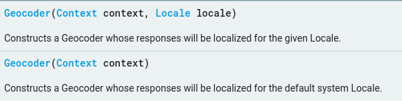
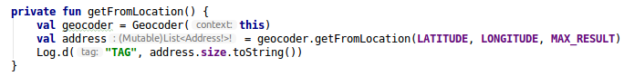
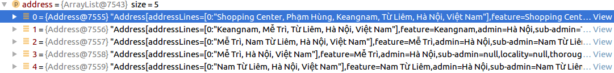
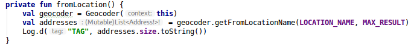
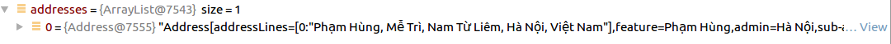
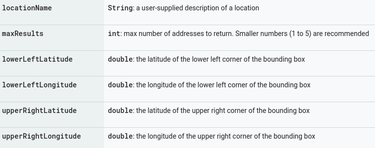
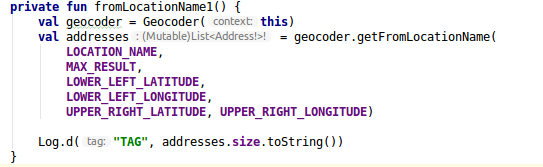
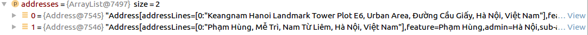
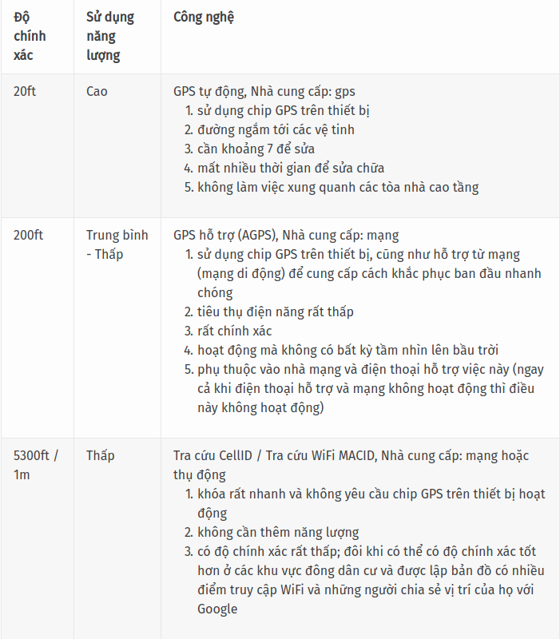

# Location

## Geocoding
- Geocoding là quá trình chuyển đổi địa chỉ (như "1600 Amphitheatre Parkway, Mountain View, CA") thành tọa độ địa lý (như latitude 37.423021 and longitude -122.083739) mà có thể sử dụng đánh dấu (place markers) trên map hoặc định vị trên map.
- Reverse geocoding ngược lại với geocoding là quá trình chuyển đổi tọa độ địa lý thành địa chỉ.
- Lớp Geocoder yêu cầu một backend service ngoài Android Framework. Các method truy vấn sẽ trả về một list rỗng nếu không có backend service trong platform.5
### Public Contructors

### Public Methods
1. getFromLocation(latitude: Double, longitude: Double, maxResult: Int): Trả về một mảng Address để mô tả địa khu vực xunh quanh latitude và longitude đã cho.
	+ Code:

	

	+ Kết quả:

	

2. getFromLocationName(locationName: String, maxResult: Int): Trả về một mảng Addresses để mô tả locationName.
	
	+ Code:

	

	+ Kết quả:
		
	

3. getFromLocationName(locationName: String, maxResult: Int, lowerLeftLatitude: Double, lowerLeftLongitude: Double, upperRightLatitude: Double, upperRightLongitude: Double): Trả về một mảng Address để mô tả locationName. Có thể chỉ định hộp giới hạn cho kết quả tìm kiếm bằng cách giới hạn trên và giới hạn dưới Latitude, Longitude.

	

	+ Code:

	

	+ Kết quả:
	
	

4. isPresent: Trả về true nếu các method getFromLocation và getFromLocationName được implement. Không có Internet các method này có thể trả về danh sách rỗng.

## Android Location Services
- Sử dụng Location Services được cung cấp bởi package *android.location*. Sử dụng các ứng dụng này có thể truy cập các dịch vụ định vị của hệ thống và cập nhật định kỳ vị trí địa lý của thiết bị.
### Location
- Lớp này đại diện cho một geographic location (vị trí địa lý), bao gồm latitude, longitudem, timestamp và các thông tin khác như bearing, altitude, velocity.
- Tất cả các location được tạo ra bởi LocationManager luôn có latitude, longitude và timestamp. Các params khác là tùy chọn.

- Tham khảo: https://developer.android.com/reference/android/location/Location

### LocationManager
- Class cung cấp quyền truy cập vào hệ thống location services. Các service này cho phép các ứng dụng có được vị trí địa lý mới nhất hoặc kích hoạt một ứng dụng được chỉ định bởi Intent khi device đi vào vị trí gần một vị trí địa lý nhất định.
- Sử dụng LocationManager ứng dụng có thể truy cập service định vị trên Android.
- Tham khảo: https://developer.android.com/reference/android/location/LocationManager
s
### LocationProvider
- Một abstract superclass cho location providers. Cung cấp định kỳ về vị trí địa lý của device.
- Có 3 loại location providers trong Android:
	+ gps(GPS, AGPS): Nhà cung cấp này xác định vị trí bằng cách sử dụng các vệ tinh. Tùy vào điều kiện, nhà cung cấp này có thể mất một lúc để trả về vị trí. Yêu cầu quyền ERIC.ACCESS_FINE_LOCATION.
	+ network (AGPS, CellID, Wifi MACID): Nhà cung cấp này xác định vị trí dựa trên tính khả dụng của các điểm truy cập Wifi và tháp di động. Kết quả được lấy bằng phương pháp tra cứu mạng. Yêu cầu một trong hai quyền ERIC.ACCESS_COARSE_LOCATION hoặc ERIC.ACCESS_FINE_LOCATION.
	+ passive (CellID, Wifi MACID): Location provider đặc biệt để nhận vị trí mà không thực sự bắt đầu sửa lỗi vị trí. Nhà cung cấp này có thể được sử dụng để nhận thụ động cập nhật vị trí khi các ứng dụng hoặc dịch vụ khác yêu cầu chúng mà không thực sự yêu cầu vị trí đó. Nhà cung cấp này sẽ trả lại các vị trí được tạo bởi các nhà cung cấp khác. Yêu cầu quyền ACCESS_FINE_LOCATION, mặc dù nếu GPS không được bật, provider này chỉ có thể trả về các bản sửa lỗi thô.

	

- Để lựa chọn LocationProvider tùy theo bài toán sử dụng class *Criteria*, Lớp này chỉ ra các tiêu chí để chọn một LocationProvider như độ chính xác, sử dụng năng lượng, độ cao, tốc độ,...

- Tham khảo: https://developer.android.com/reference/android/location/LocationProvider

### Thực hành
- Lấy vị trí hiện tại của người dùng.
- Những bước cần làm:
	+ Kiểm tra tất cả providers đã bật chưa. Một số có thể bị tắt bởi device hoặc application manifest.
	+ Nếu có provider available, bắt đầu lắng nghe location và timeout timer. Ví dụ là 20s.
	+ Nếu nhận được location cập nhật từ trình lắng nghe, sử dụng giá trị được cung cấp, dừng lắng nghe và timer.
	+ Nếu không nhận được bất cứ location cập nhật nào và timer trôi qua, sẽ sử dụng lại giá trị location trước đó.

## Tài liệu tham khảo
- Geocoding: https://developer.android.com/reference/android/location/Geocoder
- Location: https://developer.android.com/reference/android/location/Location
- LocationManager: https://developer.android.com/reference/android/location/LocationManager
- LocationProvider:
	+ https://developerlife.com/2010/10/20/gps/
	+ https://stackoverflow.com/questions/3145089/what-is-the-simplest-and-most-robust-way-to-get-the-users-current-location-on-a/3145655#3145655
	+ https://medium.com/@maheshikapiumi/android-location-services-7894cea13878

