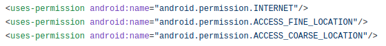
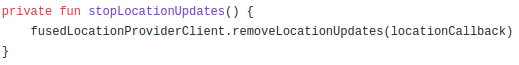

# Location

## Geocoding
- Geocoding là quá trình chuyển đổi địa chỉ (như "Keangnam Hanoi Landmark Tower, Keangnam, Từ Liêm, Hà Nội, Việt Nam") thành tọa độ địa lý (như latitude 21.0168415 and longitude 105.7837524) mà có thể sử dụng đánh dấu (place markers) trên map hoặc định vị trên map.
- Reverse geocoding ngược lại với geocoding là quá trình chuyển đổi tọa độ địa lý thành địa chỉ.
- Lớp Geocoder yêu cầu một backend service ngoài Android Framework. Các method truy vấn sẽ trả về một list rỗng nếu không có backend service trong platform.5
### Public Contructors

### Public Methods
1. getFromLocation(latitude: Double, longitude: Double, maxResult: Int): Trả về một mảng Address để mô tả địa khu vực xunh quanh latitude và longitude đã cho.
	+ Code:

	

	+ Kết quả:

	

2. getFromLocationName(locationName: String, maxResult: Int): Trả về một mảng Addresses để mô tả locationName.
	
	+ Code:

	

	+ Kết quả:
		
	

3. getFromLocationName(locationName: String, maxResult: Int, lowerLeftLatitude: Double, lowerLeftLongitude: Double, upperRightLatitude: Double, upperRightLongitude: Double): Trả về một mảng Address để mô tả locationName. Có thể chỉ định hộp giới hạn cho kết quả tìm kiếm bằng cách giới hạn trên và giới hạn dưới Latitude, Longitude.

	

	+ Code:

	

	+ Kết quả:
	
	

4. isPresent: Trả về true nếu các method getFromLocation và getFromLocationName được implement. Không có Internet các method này có thể trả về danh sách rỗng.

## Android Location Services
- Sử dụng Location Services được cung cấp bởi package *android.location* có thể truy cập các dịch vụ định vị của hệ thống và cập nhật định kỳ vị trí địa lý của thiết bị.

### Location
- Lớp này đại diện cho một geographic location (vị trí địa lý), bao gồm latitude, longitudem, timestamp và các thông tin khác như bearing, altitude, velocity.
- Tất cả các location được tạo ra bởi LocationManager luôn có latitude, longitude và timestamp. Các params khác là tùy chọn.

- Tham khảo: https://developer.android.com/reference/android/location/Location

### LocationManager
- Class cung cấp quyền truy cập vào hệ thống location services. Các service này cho phép các ứng dụng có được vị trí địa lý mới nhất hoặc kích hoạt một ứng dụng được chỉ định bởi Intent khi device đi vào vị trí gần một vị trí địa lý nhất định.
- Sử dụng LocationManager ứng dụng có thể truy cập service định vị trên Android.

- Tham khảo: https://developer.android.com/reference/android/location/LocationManager

### LocationProvider
- Cung cấp định kỳ về vị trí địa lý của device.
- Có 3 loại location providers trong Android:
	+ gps(GPS, AGPS): Nhà cung cấp này xác định vị trí bằng cách sử dụng các vệ tinh. Tùy vào điều kiện, nhà cung cấp này có thể mất một lúc để trả về vị trí. Yêu cầu quyền ERIC.ACCESS_FINE_LOCATION.
	+ network (AGPS, CellID, Wifi MACID): Nhà cung cấp này xác định vị trí dựa trên tính khả dụng của các điểm truy cập Wifi và tháp di động. Kết quả được lấy bằng phương pháp tra cứu mạng. Yêu cầu một trong hai quyền ERIC.ACCESS_COARSE_LOCATION hoặc ERIC.ACCESS_FINE_LOCATION.
	+ passive (CellID, Wifi MACID): Không tự động cập nhật vị trí thay vào đó nó sử dụng kết quả được tạo bởi nhà cung cấp khác khi các ứng dụng khác yêu cầu. Yêu cầu quyền ACCESS_FINE_LOCATION, mặc dù nếu GPS không được bật, provider này chỉ có thể trả về các bản sửa lỗi thô.

	

- Để lựa chọn LocationProvider tùy theo bài toán, sử dụng class *Criteria* - Lớp này chỉ ra các tiêu chí để chọn một LocationProvider như độ chính xác, sử dụng năng lượng, độ cao, tốc độ,...

	

	+ Criteria.ACCURACY_FINE: Yêu cầu độ chính xác cao (ACCURACY_COARSE, ACCURACY_FINE, ACCURACY_LOW, ACCURACY_MEDIUM, NO_REQUIREMENT)
	+ isAltitudeRequired = false: Nhà cung cấp trả về/không thông tin về độ cao.
	+ isBearingRequired = false: Nhà cung cấp trả về/không thông tin về bearing.
	+ isCostAllowed = true: Nhà cung cấp có được phép chịu chi phí tiền tệ hay không.
	+ powerRequirement = Criteria.POWER_HIGH: Yêu cầu năng lượng cao (POWER_LOW, POWER_MEDIUM)

- Cách tốt nhất để xử lý GPS là trước tiên sử dụng "network" or "passive" và sau đó là "gps". Tùy thuộc vào nhu cầu để chuyển đổi giữa các nhà cung cấp này bất cứ lúc nào.

- Tham khảo:
	+ https://developer.android.com/reference/android/location/LocationProvider
	+ https://developer.android.com/reference/android/location/Criteria#ACCURACY_COARSE

### Thực hành
- Tạo đối tượng Criteria()
- Tạo provider
- Request location

- Tạo Listener:

## Google Play Service Location APIs (Fused Location Provider API)
- Cung cấp vị trí cho người dùng trong ứng dụng Android là rất phổ biến. Theo mặc định, Android SDK có cung cấp Location API, tuy nhiên API này không thực sự tối ưu hóa để tiết kiệm pin cho device. Có 2 vấn đề lớn với cách tiếp cận này:
	+ Trong trường hợp bạn cần xác định vị trí chính xác, bạn phải chuyển đổi giữa các nhà cung cấp vị trí mạng và GPS (GPS không hoạt động trong nhà).
	+ Ứng dụng theo dõi, thông báo tới người dùng về khoảng cách gần địa điểm là một trải nghiệm tuyệt vời, nhưng điều này gây tốn pin.

- Vì vậy, Google đã tạo ra Fused Location Provider API tích hợp trong Google Play Services. Fused Location Provider sẽ tự động chọn nhà cung cấp vị trí để sử dụng dựa trên độ chính xác và mức độ tiêu thụ pin. API này được khuyến nghị sử dụng thay thế cho Android Location API.

- Fused Location Provider phân tích dữ liệu GPS, mạng di động và Wifi để cung cấp dữ liệu chính xác cao nhất. Ngoài ra nó còn sử dụng các cảm biến khác nhau để xác định xem người dùng đang đi bộ, lái xe,...
- Fused Location Provider có thể sử dụng để nhận các bản cập nhật vị trí theo định kỳ. Nó có thể báo cho người dùng đang vào/ra khỏi một khu vực (tính năng geofenced (định vị địa lý): https://developer.android.com/training/location/geofencing.html)

- Để hiểu thêm về Fused Location Provider API, bạn hãy tham khảo tại đây: https://developers.google.com/location-context/fused-location-provider/?source=post_page

### Last Known Location
- Sử dụng Fused Location Provider, có thể yêu cầu vị trí đã biết cuối cùng của thiết bị người dùng. Trong hầu hết các trường hợp, bạn muốn lấy vị trí hiện tại của người dùng, thường tương đương với vị trí được biết đến cuối cùng của thiết bị.
- Từ Android 8.0 (API 26) trở lên, nếu ứng dụng đang chạy ở background khi yêu cầu vị trí hiện tại, thì thiết bị chỉ tính toán vị trí một vài lần mỗi giờ.

- Set up Google Play Service: <a href="/google/play-services/setup.html">Setting Up Google PlayServices</a>
- Add permissions:	

- Tạo location services client:

- Get last location:

- Method getLastLocation() trả về một Task, bạn có thể sử dụng để lấy đối tượng Location. Location có thể null trong các trường hợp sau:
	+ Location bị tắt trong device settings.
	+ Thiết bị không ghi lại vị trí của nó, có thể là trường hợp một thiết bị mới hoặc một thiết bị đã được khôi phục về cài đặt gốc.
	+ Google Play Services trên thiết bị đã được khởi động lại và không có Fused Location provider nào hoạt động.

### Location Settings
- Khi app cần request location hoặc nhận permission update, thiết bị cần bật các cài đặt hệ thống phù hợp chẳng hạn như quét GPS hoặc Wifi. Thay vì trực tiếp kích hoạt các dịch vụ như GPS, ứng dụng của bạn chỉ cần chỉ định mức độ chính xác, mức tiêu thụ năng lượng cần thiết và khoảng thời gian cập nhật mong muốn, thiết bị sẽ tự động thực hiện các thay đổi phù hợp với cài đặt hệ thống. Các cài đặt này được xác định bởi đối tượng LocationRequest.
- Sử dụng đối tượng LocationRequest để lưu trữ các parameters cho các request. Các params này xác định độ chính xác cho các location request.
	+ setInterval(): Method này để thiết lập thời gian tính bằng miliseconds mà ứng dụng muốn cập nhật vị trí. Thời gian cập nhật vị trí có thể nhanh hoặc chậm hơn thời gian này hoặc có thể không có bản cập nhật nào cả. Client sẽ chủ động cố gắng để có được các cập nhật vị trí trong khoảng thời gian này, do đó nó ảnh hưởng trực tiếp đến pin.

	+ setFastestInterval(): Method này thiết lập thời gian nhanh nhất tính bằng miliseconds để cập nhật vị trí. Điều này cho phép bạn có được các vị trí thụ động với tốc độ nhanh hơn so với việc chủ động yêu cầu vị trí, tiết kiệm năng lượng.

	+ setPriority(): Method để thiết lập mức độ ưu tiên của request: PRIORITY_BALANCED_POWER_ACCURACY, PRIORITY_HIGH_ACCURACY, PRIORITY_LOW_POWER, PRIORITY_NO_POWER

- Khi bạn đã kết nối với Google Play Service và Location Services API, bạn có thể nhận current location setting của user device. Để làm điều đó, tạo LocationSettingsRequest.Builder.

- Khi Task hoàn thành, bạn có thể kiểm tra location setting bằng cách xem status code từ LocationSettingResponse.

- Nhắc người dùng thay đổi location setting: Để xác định xem các location setting có phù hợp với location request hay không, thêm OnFailureListener vào Task để xác thực location setting. Sau đó, kiểm tra xem đối tượng Exception có phải là instance của ResolvableApiException không. Sau đó, hiển thị hộp thoại nhắc người dùng cho phép sửa đổi location setting bằng cách gọi startResolutionForResult().

### Location Updates
- Nếu ứng dụng của bạn liên tục theo dõi vị trí, nó có thể cung cấp thông tin phù hợp hơn tới người dùng. Ngoài cách nhận vị trí cuối của thiết bị, một cách tiếp cận trực tiếp hơn là yêu cầu cập nhật định kỳ từ Fused Location Provider dựa trên Wifi và GPS.
- Request Location Updates:
	+ Đầu tiên, phải kết nối tới location service và thực hiện một location request.
		
	

	+ Bạn có thể bắt đầu cập nhật vị trí thường xuyên bằng cách gọi requestLocationUpdates(). Tùy thuộc vào request, callback trả về có thể là một danh sách list Location hoặc là một PendingIntent chứa dữ liệu mở rộng của nó. Bắt đầu request trong onResume()

	

	+ Định nghĩa location update callback

	

	+ Stop location updates: Xem xét bạn có muốn dừng cập nhật vị trí khi activity không được focus nữa. Điều này hữu ích làm giảm mức tiêu thụ năng lượng. Thực hiện trong onStop()

	

## Tối ưu hóa Pin trong bài toàn Location.

### Background Location Limits
- Trong nỗ lực giảm mức tiêu thụ năng lượng, từ Android 8.0 đã giới hạn tần xuất khi app ở background có thể lấy user current location. App có thể nhận được cập nhật vị trí chỉ một vài lần mỗi giờ.
- Background Location Limits trong Android 8.0, giới thiệu các thay đổi sau:
	+ Background Location cập nhật location một vài lần trong 1 giờ
	+ Việc quét sẽ Wifi thận trọng hơn. Location sẽ không được cập nhật khi thiết bị vẫn đang kết nối tới cùng một địa chỉ wifi.
	+ Sử dụng Geofencing response thay đổi từ 10s đến 2 phút. Sự thay đổi này đáng chú ý giúp cải thiện hiệu suất pin, tốt hơn tới 10 lần trên một số thiết bị.
- Xem xét các trường hợp sử dụng khi app ở Background, vì vị trí được cập nhật không thường xuyên. Bạn có thể cập nhật vị trí thường xuyên hơn bằng cách thực hiện một trong các hành động sau:
	+ Đưa app về foreground
	+ Start một foreground service bằng cách gọi startForegroundService(), kết hợp sử dụng một notification.
	+ Sử dụng các thành phần của Geofencing API như là GeofencingApi, được tối ưu hóa pin.
	+ Sử dụng lắng nghe vị trí thụ động, có thể nhận được vị trí nhanh hơn nếu có các ứng dụng nền tảng yêu cầu cập nhật vị trí với tốc độ nhanh hơn.
	
- Việc yêu cầu vị trí khi app ở background có ảnh hưởng tới các API:
- Đối với Fused Location Provider:
	+ Nếu app chạy ở background, dịch vụ hệ thống vị trí sẽ tính toán một vị trí mới cho app của bạn chỉ một vài lần mỗi giờ. Ngay cả khi ứng dụng của bạn yêu cầu cập nhật vị trí thường xuyên hơn. Tuy nhiên bằng cách sử dụng *batched version* của FLP, bạn có quyền truy cập vào lịch sử vị trí thường xuyên hơn sau khi ứng dụng của bạn nhận được cập nhật hàng loạt, điều này cũng chỉ xảy ra vài lần một giờ.
	+ Nếu ứng dụng của bạn đang chạy ở foreground, không có thay đổi về việc lấy vị trí.
- Đối với Geofencing:
	+ Khi app ở background có thể nhận được các sự kiện chuyển tiếp địa lý thường xuyên hơn các cập nhật từ FLP.
	+ Khả năng đáp ứng trung bình cho một sự kiện định vị địa lý cứ sau vài phút hoặc lâu hơn.
- Đối với Location Manager: Cập nhật vị trí được cung cấp cho app khi ở background chỉ một vài lần một giờ.
### Understand battery drain
- Vấn đề tiêu hao pin có liên quan trực tiếp trong các trường hợp sau:
	+ Accuracy (Độ chính xác): Độ chính xác của vị trí càng cao thì độ hao pin càng lớn
	+ Frequency: Vị trí cang thường xuyên được tính toán thì hao pin càng nhiều.
	+ Latency (Độ trễ): Độ trễ càng ít thì hao pin càng nhiều.

#### Accuracy-Độ chính xác
- Có thể điều chỉnh độ chính xác bằng method setPriority
	+ PRIORITY_HIGH_ACCURACY: Cung cấp vị trí chính xác nhất có thể, được tính toán bằng cách sử dụng nhiều đầu vào (GPS, WiFi, mạng di động) và gây hao pin đáng kể
	+ PRIORITY_BALANCED_POWER_ACCURACY: Cung cấp vị trí chính xác trong khi tối ưu hóa năng lượng. Rất hiếm khi sử dụng GPS, thường kết hợp WIfi và mạng di động để tính toán vị trí thiết bị.
	+ PRIORITY_LOW_POWER: Chủ yếu dựa vào các tháp di động và tránh các đầu vào GPS và Wifi, cung cấp độ chính xác thô (cấp thành phố) với mức hao pin tối thiểu.
	+ PRIORITY_NO_POWER: Nhận vị trí thụ động từ các ứng dụng khác mà vị trí đã được tính toán.

#### Frequency
- Có thể chỉ định tần suất vị trí bằng 2 phương pháp:
	+ setInterval(): Chỉ định khoảng thời gian mà ứng dụng muốn cập nhật locaiton.
	+ setFastestInterval(): Method này thiết lập thời gian nhanh nhất tính bằng miliseconds mà ứng dụng có thể xử lý các cập nhật vị trí.

#### Latency
- Có thể thiết lập độ trễ bằng hàm setMaxWaitTime(), thường truyền vào một giá trị lớn hơn nhiều lần so với khoảng thời gian được chỉ định trong setInterval().
- Cài đặt này làm trì hoãn việc phân phối vị trí và cập nhật nhiều lần giúp giảm thiểu tiêu thụ pin.
- Nếu ứng dụng của bạn không cần cập nhật vị trí ngay lập tức, nên thiết lập giá trị lớn nhất có thể cho setMaxWaitTime().
- Khi sử dụng geofences, nên cài đặt phương thức setNotificationResponsiveness() để bảo toàn năng lương, giá trị 5p hoặc lớn hơn được đề nghị.

### Location best practices
- Tham khảo: https://developer.android.com/guide/topics/location/battery#remove-location

#### Remove location updates
- Một vấn đề gây hao pin không cần thiết là không remove location update khi không cần thiết. Điều này có thể xảy ra, như khi các trong onStart() hoặc onResume() gọi phương thức requestLocationUpdates() mà không có removeLocationUpdates() trong các method onPause() hoặc onStop().

#### Set timeouts
- Đặt thời gian chờ hợp lý khi dừng cập nhật vị trí để chống hao pin. Thời gian chờ đảm bảo rằng các bản cập nhật không tiếp tục vô thời hạn và nó bảo vệ ứng dụng trong các trường hợp yêu cầu cập nhật nhưng không được xóa.
- Đối với Fused Location Provider, thêm thời gian chờ bằng cách gọi setExpirationDuration() thời gian tính từ khi method được gọi lần cuối hoặc setExpirationTime() thời gian tính từ khi hệ thống khởi động lần cuối.
- Để thêm thời gian chờ vào geofence, sử dụng  setExpirationDuration().

#### Batch request
- Đối với các trường hợp non-foreground, gộp nhiều request cùng nhau. Có thể sử dụng setInterval() để chỉ định thời gian bạn muốn tính toán vị trí. Sau đó sử dụng setMaxWaitTime() để đặt khoảng thời gian chờ tối đa để cập nhật location.

- Trong ví dụ trên, vị trí được tính khoảng 10p một lần và khoảng 6 điểm dữ liệu location được phân phối theo khoảng mỗi giờ. Mặc dù bạn vẫn nhận được cập nhật vị trí cứ sau mười phút hoặc có thể lâu hơn nhưng thiết bị vẫn tiết kiệm pin vì nó chỉ thức dậy mỗi giờ hoặc lâu hơn.

#### Use passive location updates
- Trong trường hợp sử dụng background, đây là một cách tốt để cải thiện cập nhật vị trí. 
- Từ Android 8.0 trở lên (background location limit), không thực hiện cập nhật location
- Đối với các thiết bị cũ hơn vẫn cập nhật location -> Gây tốn pin

## Tài liệu tham khảo
- Geocoding: https://developer.android.com/reference/android/location/Geocoder
- Location: https://developer.android.com/reference/android/location/Location
- LocationManager: https://developer.android.com/reference/android/location/LocationManager
- LocationProvider:
	+ https://developerlife.com/2010/10/20/gps/
	+ https://medium.com/@maheshikapiumi/android-location-services-7894cea13878
- Fused Location Provider API: 
	+ https://developer.android.com/training/location
	+ https://developers.google.com/android/reference/com/google/android/gms/location/package-summary

